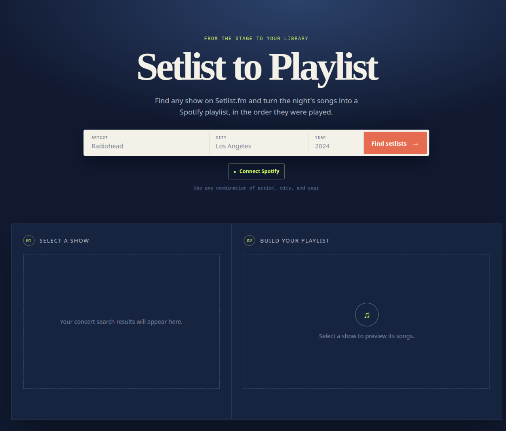

# Setlist to Playlist

A small web app that turns a concert setlist into a Spotify playlist, in the order the songs were played. Search Setlist.fm by artist, city, and year, choose a show, review its songs, and save the result to your own Spotify account.

- 🎵 Search real concert setlists by artist, city, and year
- 📋 Review the songs before creating a playlist, including covers and encores
- 🎧 Connect your own Spotify account with secure PKCE sign-in
- 🔒 Create private playlists by default, or choose to make one public
- 🆓 Free and open source — bring your own Setlist.fm and Spotify credentials

**[Try the live demo →](https://setlist-to-playlist.krynsky.com/)**



---

## Table of Contents

- [What It Does](#-what-it-does)
- [How It Works](#how-it-works)
- [Configuration](#-configuration)
- [Run Locally](#-run-locally)
- [Pinokio](#-pinokio)
- [Tech Stack](#-tech-stack)
- [Development](#-development)
- [Privacy and Security](#-privacy-and-security)
- [License](#-license)

---

## 🎵 What It Does

Setlist to Playlist helps you recreate the night in Spotify:

Step | What happens
--- | ---
1. Search | Find Setlist.fm shows using any combination of artist, city, and year.
2. Select | Choose a show and see its setlist, in performance order.
3. Review | Include or exclude individual songs before the playlist is created. Covers and encore songs are identified.
4. Create | The app matches the selected songs on Spotify, creates a playlist in your account, and adds the matches in order.

Playlist names include the artist, city, venue, and date. Playlists are private unless you explicitly enable **Make playlist public**.

---

## How It Works

The app searches Setlist.fm through a server route so your Setlist.fm API key stays off the browser. Spotify sign-in uses Authorization Code with PKCE: Spotify authorizes the app directly in your browser, and no Spotify client secret is required.

Song matching searches Spotify by track title and artist. If Spotify cannot find a song, the finished playlist reports it as unmatched rather than silently adding a different track.

---

## ⚙️ Configuration

Every installation needs its own API credentials.

1. Create a [Setlist.fm API key](https://www.setlist.fm/settings/api).
2. Create a [Spotify app](https://developer.spotify.com/dashboard) and copy its **Client ID**.
3. Add the app's exact address, including the trailing slash, as a Spotify Redirect URI:

   - Local development: `http://localhost:3000/`
   - Pinokio: the localhost URL shown by Pinokio after you start the app
   - Your own deployment: your public app URL, ending in `/`

4. Copy [`app/.env.example`](app/.env.example) to `app/.env.local` and add your values:

   ```env
   SETLIST_FM_API_KEY=your_setlist_fm_key
   SPOTIFY_CLIENT_ID=your_spotify_client_id
   ```

`SETLIST_FM_API_KEY` is used only by the server. `SPOTIFY_CLIENT_ID` is intentionally available to the browser because Spotify identifies public OAuth apps by client ID.

---

## 💻 Run Locally

### Prerequisites

- Node.js 22.13 or later
- A Setlist.fm API key and Spotify Client ID

### Commands

```bash
# Clone the repository
git clone https://github.com/krynsky/Setlist-to-Playlist.git
cd Setlist-to-Playlist

# Configure your credentials
cp app/.env.example app/.env.local

# Install and start the app
cd app
npm ci
npm run dev
```

Open `http://localhost:3000/`, then connect Spotify and search for a show.

On Windows PowerShell, use this copy command instead:

```powershell
Copy-Item app/.env.example app/.env.local
```

---

## 🧩 Pinokio

This repository includes a one-click [Pinokio](https://desktop.pinokio.co/docs/#/) launcher.

1. Clone the repository into `PINOKIO_HOME/api/setlist-to-playlist`.
2. Open **Setlist to Playlist** in Pinokio and choose **Install**.
3. Add your two values to `app/.env.local`.
4. Choose **Start** and add the exact localhost URL Pinokio shows you as a Redirect URI in your Spotify app.

The launcher also includes **Update** and **Reset** actions.

---

## 🧰 Tech Stack

Layer | Technology
--- | ---
Web app | Next.js 16, React 19, TypeScript
Setlist search | Setlist.fm REST API
Playlists and sign-in | Spotify Web API and Authorization Code with PKCE
Styling | Tailwind CSS
Local launcher | Pinokio

---

## 🛠️ Development

Run these commands from `app`:

```bash
# Check code quality
npm run lint

# Build and run the portable-app test suite
npm test

# Production build only
npm run build
```

### Project Structure

```text
app/
  app/
    api/          # Setlist.fm proxy and runtime configuration route
    page.tsx      # Search, setlist selection, Spotify sign-in, playlist creation
  public/         # App icons and static assets
  tests/          # Portable-app build checks
assets/           # README images
install.js        # Pinokio install action
start.js          # Pinokio start action
reset.js          # Pinokio dependency reset action
update.js         # Pinokio update action
```

---

## 🔐 Privacy and Security

- Your Setlist.fm API key stays on the server route and is never sent to the browser.
- Spotify authentication happens directly with Spotify using PKCE; no Spotify client secret is stored or required.
- Spotify access and refresh tokens are stored in your browser's local storage for your own session.
- The app creates playlists only in the Spotify account you authorize.

---

## 📄 License

[MIT](LICENSE)
